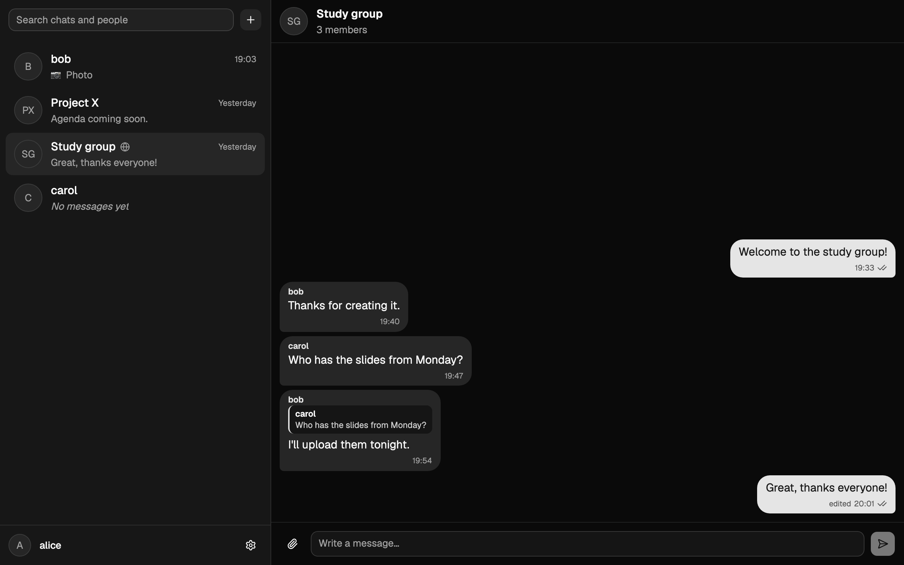
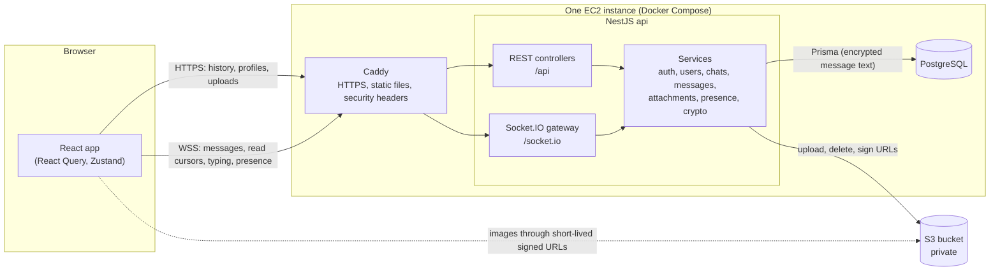
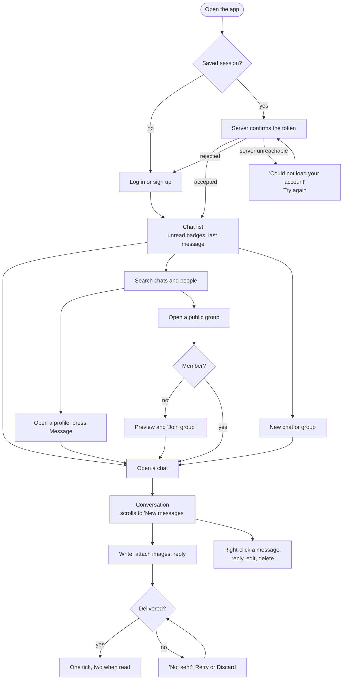
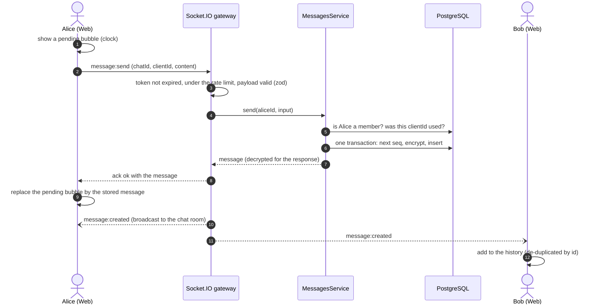
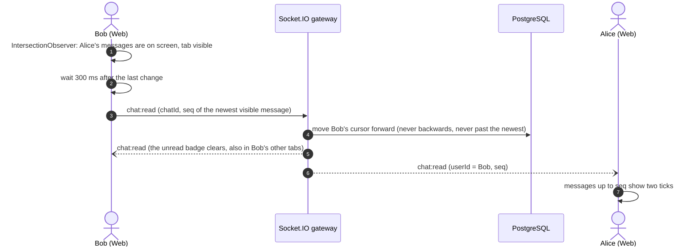
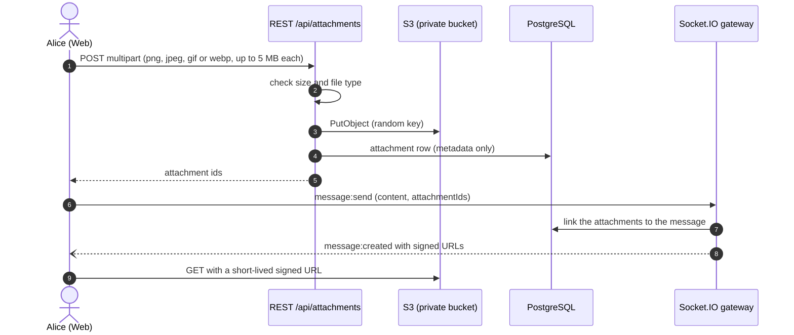
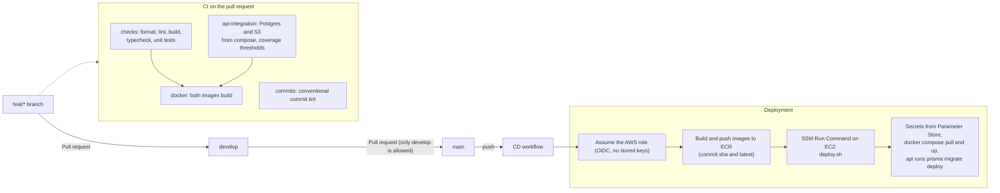
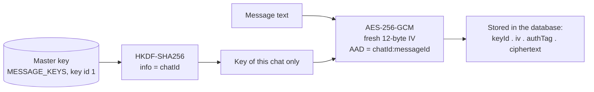

# Chat App

## About

A real-time web chat built as a university diploma project: direct messages and group chats, public group search, replies, images, read receipts, typing indicators and online status. The server stores message text encrypted, delivers it live over one authenticated WebSocket connection, and is deployed to AWS with a fully automated pipeline.

The project started as a small MongoDB + antd + MobX prototype. It was rebuilt step by step, test first, following [docs/IMPROVEMENT_PLAN.md](docs/IMPROVEMENT_PLAN.md) (the review, the decisions and the reasons for them). [docs/implementation-log.md](docs/implementation-log.md) records what was actually done, and where and why it differs from the plan.



## Features

- **Chats:** direct messages, group chats, and public groups that anyone can find by searching and join
- **Messages:** replies with a quoted preview, edit and delete (with a confirmation), images (up to 10 per message), optimistic sending with retry when the connection is down
- **Awareness:** unread counters, a "New messages" marker when a chat is opened, read receipts (one tick stored, two ticks read, "Read by 2 of 4" in groups), typing indicators, online status and "last seen"
- **People:** profiles, friends, privacy settings (hide last seen, hide from search)
- **Security:** message text encrypted at rest (AES-256-GCM, a separate key per chat), private attachments behind short-lived signed URLs, authorisation checked on the server for every operation
- **Works on a phone:** the chat list and the conversation are two screens with a back button

## Tech stack

| Area         | Technology                                                                                                 |
| ------------ | ---------------------------------------------------------------------------------------------------------- |
| Web          | React 19, Vite 8, TypeScript, Tailwind CSS 4, shadcn/ui (Radix), TanStack Query, Zustand, socket.io-client |
| API          | NestJS 12, Socket.IO, Prisma 7, zod, bcrypt, helmet                                                        |
| Shared       | `@chat/shared`: zod schemas, DTO types, the socket event contract and small helpers, used by both sides    |
| Database     | PostgreSQL 17                                                                                              |
| File storage | AWS S3 (SeaweedFS, an S3-compatible server, for local development)                                         |
| Tooling      | pnpm 12 workspaces, oxlint, oxfmt, lefthook, commitlint (conventional commits)                             |
| Tests        | Vitest, Testing Library, supertest, real Socket.IO clients, `node:test` for repository rules               |
| Delivery     | Docker, Caddy (HTTPS and static files), GitHub Actions, AWS (ECR, EC2, SSM, S3)                            |

## Architecture

One **modular monolith** instead of microservices: one NestJS application with a module per area (auth, users, chats, messages, attachments, realtime, presence, storage, crypto). The gateway that speaks Socket.IO contains no business rules; it validates, calls the same services as the REST controllers, and broadcasts the domain events they publish.



The database tables are documented, with an ER diagram, in [docs/database.md](docs/database.md); the REST routes in [docs/api.md](docs/api.md); the frontend's structure in [docs/frontend.md](docs/frontend.md).

## How it works

### What a user does



### Sending a message

The client shows the message at once as "sending", then sends it over the socket with a client-generated id. If the acknowledgement is lost, sending again with the same id returns the same message: it is stored and broadcast only once.



### Reading, unread counters and receipts

There is no "read" flag per message. Each member has one **read cursor** (the `seq` of the newest message they have seen). That is enough to show ticks, unread counters and the "New messages" marker, and it costs one row update instead of one per message.



### Uploading an image

Files never travel over the socket (packets are limited to 100 KB). They are uploaded over REST first; the message then refers to them by id.



The whole flow in a single diagram, including log-in and connecting, is in [docs/sequence-diagram.md](docs/sequence-diagram.md).

### From a commit to production



## Repository structure

```
apps/
  api/            NestJS backend (@chat/api)
    prisma/       schema.prisma, migrations, seed
    src/modules/  auth, users, chats, messages, attachments, realtime, presence, storage, crypto
  web/            React frontend (@chat/web), with its Dockerfile and Caddyfile
packages/
  shared/         zod schemas, DTO types, socket contract, utilities (@chat/shared)
deploy/           production compose file, deploy script, settings template
docs/             plan, implementation log, API, realtime, database, frontend, testing, deployment
tooling/          repository-level tests (node:test) and the git hooks installer
.github/workflows ci.yml, pr-source.yml, cd.yml
docker-compose.yml  local Postgres and S3 (and, with a profile, the whole stack)
```

## Getting started

**Prerequisites:** Node 24 (`nvm use` reads `.nvmrc`), pnpm 12 (`corepack enable`) and Docker.

1. Install the dependencies:

   ```bash
   pnpm install
   ```

2. Create the api's settings:

   ```bash
   cp apps/api/.env.example apps/api/.env
   ```

3. Generate the message encryption key and paste the output into `MESSAGE_KEYS` in `apps/api/.env` (`MESSAGE_KEY_ID` is already `1`):

   ```bash
   echo "1:$(openssl rand -base64 32)"
   ```

4. Start Postgres and S3, create the tables and add demo data:

   ```bash
   pnpm infra:up
   ```

   ```bash
   pnpm db:migrate
   ```

   ```bash
   pnpm db:seed
   ```

5. Start the api and the web app:

   ```bash
   pnpm dev
   ```

Open http://localhost:5173 and log in as `alice`, `bob` or `carol` with the password `password123`. Open a second browser profile as another user to see typing, read ticks and presence.

**Everything in Docker** (the api and the web app too, served on http://localhost:8080):

```bash
docker compose --profile full up --build
```

If a default port is taken on your machine (for example 5432), see [docs/development.md](docs/development.md) for the port settings and the rest of the day-to-day workflow.

## Scripts

Run from the repository root.

| Command             | What it does                                                                |
| ------------------- | --------------------------------------------------------------------------- |
| `pnpm dev`          | builds the shared package, then runs the api and the web app in watch mode  |
| `pnpm build`        | builds every package                                                        |
| `pnpm typecheck`    | type-checks every package                                                   |
| `pnpm test`         | repository rules, shared, api unit and web tests (needs no services)        |
| `pnpm test:repo`    | only the repository-level tests (structure, tooling, Docker, CI/CD, README) |
| `pnpm test:int`     | the api integration tests (needs `pnpm infra:up`)                           |
| `pnpm test:cov`     | all api tests with coverage and enforced thresholds (needs `pnpm infra:up`) |
| `pnpm lint`         | oxlint                                                                      |
| `pnpm lint:fix`     | oxlint with automatic fixes                                                 |
| `pnpm format`       | oxfmt: formats every file                                                   |
| `pnpm format:check` | checks formatting without changing files (what CI runs)                     |
| `pnpm infra:up`     | starts local Postgres and S3                                                |
| `pnpm infra:down`   | stops them (the data stays in Docker volumes)                               |
| `pnpm db:migrate`   | applies (and creates) Prisma migrations in development                      |
| `pnpm db:seed`      | adds the demo users, chats and messages                                     |

## Testing, linting and formatting

Every change in this repository started with a failing test. [docs/testing.md](docs/testing.md) explains the layers, what is real and what is faked, and the lessons learned from flaky tests.

| Layer            | Tests                                                                               |
| ---------------- | ----------------------------------------------------------------------------------- |
| Repository rules | structure, tooling, Docker images, workflows, deploy script, README                 |
| Shared package   | schemas, socket contract, helpers                                                   |
| API              | unit tests, plus integration tests over real HTTP, real WebSockets, Postgres and S3 |
| Web              | components and hooks against a fake socket and mocked REST modules                  |

The API's coverage is above 99% statements and 97% branches; CI fails if it drops. Formatting and linting run in a git hook on staged files and again in CI, and commit messages are checked by commitlint ([conventional commits](https://www.conventionalcommits.org/), scopes `web`, `api`, `shared`, `db`, `infra`, `ci`, `deps`, `docs`, `repo`).

## Security

This is **not** end-to-end encryption (see the limits below). It is seven cheap layers that together make sure nobody except the running server can read a message, and nobody can read or inject messages they have no right to. The reasoning is in section 2.3 of the plan.

| #   | Threat                                      | Defence                                                                                                                                                                                                             |
| --- | ------------------------------------------- | ------------------------------------------------------------------------------------------------------------------------------------------------------------------------------------------------------------------- |
| 1   | Someone sniffs the network                  | HTTPS and WSS terminated by Caddy with automatic certificates, an HSTS header, and the socket token sent in the handshake payload, never in the URL                                                                 |
| 2   | Reading, editing or sending as someone else | Authorisation on the server for every operation, over REST and WebSocket: the sender always comes from the verified token, membership and role are re-checked, every payload is validated, sockets are rate limited |
| 3   | A database leak (dump, backup, snapshot)    | Message text is encrypted by the application (AES-256-GCM) before it reaches Postgres; the encrypted disk adds a second layer                                                                                       |
| 4   | Key theft, or no way to change keys         | A key ring with key ids, so keys can be rotated; keys live in AWS Parameter Store and are injected at deployment, never committed or baked into images                                                              |
| 5   | A leaked attachment                         | Private bucket, random object keys, file type and size limits, short-lived signed URLs handed out only after a membership check                                                                                     |
| 6   | XSS                                         | Messages are rendered as text, never as HTML; `Content-Security-Policy` and `nosniff` headers; `helmet` on the api                                                                                                  |
| 7   | Leaks through logs, brute-forced logins     | Message content is never logged; throttling on log-in and sign-up; bcrypt                                                                                                                                           |

How the encryption works:



Because the authenticated data contains the chat and message ids, a ciphertext copied to another message or chat fails to decrypt instead of showing something wrong.

**Honest limits.** The encryption protects data at rest. The running server, and anyone who takes control of it or of the key, can read messages: true end-to-end encryption would remove that, and is future work (it needs device keys, keys wrapped for every group member, re-keying on membership changes and key recovery). Chat titles and usernames are stored in plain text because they are searched, and attachment file names and sizes are plain metadata.

## Realtime

Everything that happens live (sending, editing and deleting messages, read cursors, typing, presence) goes through **one authenticated Socket.IO connection**, because it needs acknowledgements (so a failed send is known and can be retried), server-to-client events, and one place to check the token. History and file uploads stay on **REST**: they are plain request/response, they are cached by React Query, and a file does not belong in a socket packet. The event reference, the acknowledgement format and the rules a client must follow (refetch after every reconnect, de-duplicate by id) are in [docs/realtime.md](docs/realtime.md).

## Contributing

Work happens on short-lived branches named `feat/*`, `fix/*` and so on. A pull request goes into `develop`; a pull request from `develop` into `main` is a release. Branch protection requires the CI checks, and a workflow rejects pull requests into `main` from any other branch. Commit messages follow [conventional commits](https://www.conventionalcommits.org/) (`feat(api): add message search`); a hook and a CI job check them.

[docs/development.md](docs/development.md) describes the workflow, the commands and the test-first routine.

## Deployment

Merging `develop` into `main` deploys automatically. GitHub Actions authenticates to AWS with OIDC (no stored keys), builds the api and web images, pushes them to ECR, and tells one EC2 instance, through SSM, to pull them and restart the Docker Compose stack: Caddy (HTTPS, static files, proxy), the api, and PostgreSQL on an encrypted disk. Secrets come from SSM Parameter Store and files go to a private S3 bucket through the instance's IAM role. Migrations run when the api container starts, and a rollback is a deployment of an older commit.

The one-time AWS setup, the secrets, the rollback procedure and troubleshooting are in [docs/deployment.md](docs/deployment.md).
