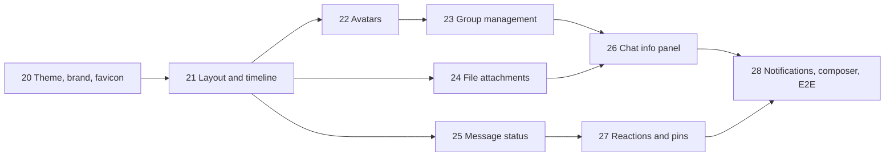

# Modernization plan (part 2)

The first plan ([IMPROVEMENT_PLAN.md](./IMPROVEMENT_PLAN.md), Steps 1-19) rebuilt the app's foundations. This plan builds on them: it makes the app look finished, fills the obvious gaps in groups and attachments, and adds a few features people expect from a messenger. Steps are numbered from 20 so the history stays one sequence.

The working rules stay the same: **test first**, one branch and one pull request into `develop` per step, docs updated in the same step, and both plans are kept (they are the design record).

## What was asked for, and where it lands

| Request                                     | Step   |
| ------------------------------------------- | ------ |
| Favicon                                     | 20     |
| Light and dark theme, a lighter dark theme  | 20     |
| Refine the UI (layout, messages, modals)    | 21     |
| User avatars and chat avatars               | 22     |
| Add users to an existing group              | 23     |
| Files other than images, with a size limit  | 24     |
| Message status                              | 25     |
| Attachments in the chat info modal (+ more) | 26     |
| New features found in the review            | 27, 28 |

## What the review found

Besides the requests, reading the code and using the app turned up these gaps. Each one is fixed in the step named.

| #   | Finding                                                                                                                                            | Why it matters                                                                                           | Step |
| --- | -------------------------------------------------------------------------------------------------------------------------------------------------- | -------------------------------------------------------------------------------------------------------- | ---- |
| 1   | The palette is neutral grey with no accent colour; the dark background is almost black (`oklch(0.145)`) and my own messages are near-white bubbles | Harsh contrast, nothing marks the app as "ours"                                                          | 20   |
| 2   | Reply, edit and delete are only reachable by right-clicking a message                                                                              | Invisible to new users; not reachable with the keyboard; long-press on a phone is the only touch path    | 21   |
| 3   | No date separators, no grouping of consecutive messages, no "jump to latest" button                                                                | Long chats are hard to read and navigate                                                                 | 21   |
| 4   | Links in messages are plain text                                                                                                                   | Cannot be clicked                                                                                        | 21   |
| 5   | A group cannot be changed after creation: no adding or removing people, no leaving, no renaming                                                    | The most visible functional gap                                                                          | 23   |
| 6   | Signed attachment URLs live one hour, and images use `loading="lazy"`                                                                              | An image scrolled into view more than an hour after its page was loaded gets a `403` and shows as broken | 24   |
| 7   | Ticks only know "stored" and "read"; in a group, two ticks mean "at least one person read it"                                                      | Not what people expect from WhatsApp or Telegram                                                         | 25   |
| 8   | Toasts use `next-themes`, which injects an inline script; the production CSP (`script-src 'self'`) blocks it                                       | Theme switching would flash the wrong theme on load                                                      | 20   |
| 9   | The web bundle is one 760 kB chunk                                                                                                                 | Slower first load, mostly for dialogs nobody opened yet                                                  | 26   |
| 10  | No browser-level end-to-end test                                                                                                                   | The real WebSocket + UI flow is only checked by hand                                                     | 28   |
| 11  | `img-src` in the CSP allows any `https:` host                                                                                                      | Wider than needed once the bucket's host is known                                                        | 24   |

## Order

Theme and layout go first because every later step adds UI on top of them. Steps 24 and 25 do not depend on each other. Steps 27 and 28 are the new features; they can be dropped or reordered without affecting the rest.

## Data changes at a glance

| Step | Database (Prisma migration)                                                             | Socket events                             | REST                                                                                              |
| ---- | --------------------------------------------------------------------------------------- | ----------------------------------------- | ------------------------------------------------------------------------------------------------- |
| 22   | `users.avatar_key`, `chats.avatar_key`                                                  | `chat:changed` reused, `user:changed`     | `PUT`/`DELETE /users/me/avatar`, `PUT`/`DELETE /chats/:id/avatar`                                 |
| 23   | `ADMIN` in the role enum; `messages.kind` (`USER`/`SYSTEM`) and `messages.event` (JSON) | `chat:removed`                            | `PATCH /chats/:id`, members `POST`/`PATCH`/`DELETE`, `POST /chats/:id/leave`, `DELETE /chats/:id` |
| 24   | none (the `attachments` table already has name, type and size)                          | none                                      | `POST /attachments` accepts any file                                                              |
| 25   | `chat_members.last_delivered_seq`                                                       | `chat:delivered` (both directions)        | none                                                                                              |
| 26   | `messages.has_link`                                                                     | none                                      | `GET /chats/:id/media`, `/files`, `/links`; `PATCH /chats/:id/settings`                           |
| 27   | `message_reactions`; `messages.pinned_at`, `pinned_by_id`                               | `reaction:set`, `message:pin`, broadcasts | `GET /chats/:id/pins`                                                                             |
| 28   | `chat_members.muted_until`                                                              | none                                      | `PATCH /chats/:id/settings` (mute)                                                                |

---

## Step 20: Theme, brand colour and favicon

**Branch:** `feat/theme-and-brand`. Frontend only.

**Goal:** a recognisable look, a light theme, a dark theme that is dark grey instead of black, and an icon in the browser tab.

1. **Logo and favicon.** One SVG mark (a speech bubble in the brand colour) in `apps/web/public/`:
   - `favicon.svg` (modern browsers), `favicon.ico` 32×32, `apple-touch-icon.png` 180×180, `icon-192.png` and `icon-512.png`;
   - `manifest.webmanifest` (name, icons, `theme_color`, `background_color`), so "Add to home screen" shows the icon;
   - the PNG and ICO files are generated once from the SVG by a small script in `tooling/` (headless Chrome, as for the README screenshot) and committed;
   - the same mark replaces the plain icon on the log-in screen and appears at the top of the sidebar.
2. **Palette.** Rework the tokens in `styles.css`:
   - a brand hue (decided: **lagoon**, a deep sea-glass teal, `oklch(0.6 0.105 190)`: calm, trustworthy and clearly not the usual blue or purple; slightly lighter in dark mode) for `--primary`, the ring, links, unread badges and own message bubbles;
   - **dark theme:** background around `oklch(0.21 0.01 270)` (dark slate instead of black), cards and popovers a step lighter, the sidebar a step darker than the chat, borders visible but soft;
   - new chat-specific tokens: `--bubble-own`, `--bubble-own-foreground`, `--bubble-other`, `--chat-background`, so bubbles stop reusing `--primary` and `--muted`;
   - check every foreground/background pair for WCAG AA contrast (4.5:1 for text). A small unit test computes the contrast of the main pairs from the CSS, so a later palette change cannot silently break readability.
3. **Theme switching.** Light, dark and "system":
   - a `theme-store` (Zustand, persisted) and a theme picker in Settings;
   - `public/theme-init.js`, loaded synchronously in `<head>`, sets the `dark` class before React starts. It is a file, not an inline script, so the CSP allows it and there is no flash of the wrong theme;
   - `<meta name="theme-color">` for both schemes, so the mobile browser bar matches;
   - drop `next-themes`: the toaster reads the store instead (finding 8).
4. Remove `class="dark"` from `index.html` and update the repo test that pinned it.

**Tests:** the theme store (system preference via `matchMedia`, persistence), `theme-init.js` run against a fake `document`, the contrast check, the Settings picker, repo tests for the favicon files and the manifest.

**Done when** the tab shows the icon, both themes are readable, switching is instant and survives a reload without a flash, and the production CSP reports no violation.

---

## Step 21: Layout and message timeline

**Branch:** `feat/ui-refinement`. Frontend only.

**Goal:** a timeline that is easy to read and use, and dialogs that feel consistent.

1. **Timeline.**
   - **Date separators** ("Today", "Yesterday", "Monday", "12 March 2026"), sticky while scrolling.
   - **Grouping:** consecutive messages from the same person within 5 minutes share one name label and avatar and have tighter spacing; the bubble's corner rounding marks the first and last of a group.
   - **Jump to latest:** a floating button appears when scrolled up, with the number of new messages that arrived meanwhile.
   - **Clickable links:** `http`/`https` URLs become links with `target="_blank" rel="noopener noreferrer"`. Text is still rendered as text: the link detection produces React elements, never HTML (keeps the XSS guarantee). A unit test feeds it hostile input.
   - Emoji-only messages (1-3 emoji) shown large, without a bubble.
2. **Message actions without right-click** (finding 2). On hover (desktop) a small toolbar appears next to the bubble: reply, react (placeholder until Step 27), and a "⋯" menu with the same items as the context menu. Bubbles become focusable, so the keyboard user can tab to a message and press Enter or the context-menu key. Long-press keeps working on touch.
3. **Composer.** Auto-growing text area with a visible maximum height, character counter when close to the 4000 limit, clearer reply bar, buttons aligned to the last line.
4. **Layout.** A sidebar header (logo, "New chat"), resizable sidebar width on desktop (remembered), chat header with the online dot and an "info" button, consistent empty states (no chat selected, no messages, no search results) with an illustration-free icon and one line of text.
5. **Dialogs.** One shared structure: header with title and description, scrollable body, footer with actions; full-screen sheets on phones (`Sheet` from shadcn) instead of centred dialogs. The create-chat dialog gets a member picker with search, chips for the selected people and their avatars (placeholders until Step 22).

**Tests:** separator and grouping rules as pure functions (`groupTimeline(messages, now)`), the link detector, the jump-to-latest button, keyboard access to the actions menu, the composer counter. Existing message list tests are kept green.

**Done when** a long chat reads well on desktop and phone, every action is reachable without a mouse, and the screenshots in the README are updated.

---

## Step 22: Avatars for users and chats

**Branch:** `feat/avatars`.

**Decision: resize in the browser, validate on the server.** The browser crops the picture to a square and re-encodes it as a 256×256 WebP (a `<canvas>`), so no native image library (like `sharp`) is needed on the server and EXIF data (location!) is dropped. The server still checks the bytes: real image content (the existing `detectImageType`), at most 512 kB, and only WebP, PNG or JPEG.

1. **Database:** `users.avatar_key` and `chats.avatar_key`, both nullable. The key contains a random id, so a new avatar is a new object and caches never show the old one.
2. **API:**
   - `PUT /api/users/me/avatar` (multipart, one file) and `DELETE /api/users/me/avatar`;
   - `PUT /api/chats/:id/avatar` and `DELETE …` for groups (owner and admins, see Step 23);
   - the old object is deleted from S3 after the new one is stored;
   - DTOs get `avatarUrl: string | null` (`PublicUserDto`, `MeDto`, chat summary and details, chat members, message sender). For a direct chat, the chat's avatar is the other person's.
3. **Cacheable signed URLs.** Signed URLs change with every request, which defeats the browser cache. Avatar URLs are signed with the signing time rounded down to the hour and a two-hour lifetime: the URL is identical for an hour and always valid for at least one more, so the browser downloads each avatar about once an hour. The same helper fixes finding 6 in Step 24.
4. **Frontend:**
   - `ChatAvatar` shows the picture when there is one, otherwise initials on a colour derived from the user or chat id (stable, eight hues that pass contrast in both themes);
   - avatar editor in Settings and in the group's info: choose a file, drag to position, zoom, preview, save; remove;
   - avatars in the chat list, header, members list, profiles, and next to the last message of each group in the timeline (Step 21's grouping).
5. **Realtime:** a new group avatar is announced with the existing `chat:changed`; a new user avatar with `user:changed { userId }`, sent (like presence) to everyone who shares a chat with that user, so their cached profiles and member lists refresh.

**Tests:** upload rules (type, size, non-image content, someone else's group), the old object is removed, URL stability within an hour (fake clock), DTO fields, the crop helper (canvas mocked), fallback colours.

**Done when** both kinds of avatar can be set and removed, appear everywhere within a second for other users, and survive a reload without being downloaded again.

---

## Step 23: Group management

**Branch:** `feat/group-management`.

**Goal:** a group can change after it is created: people join, leave and are removed, and the group can be renamed. Everyone sees what happened in the timeline.

1. **Roles:** `OWNER`, `ADMIN` (new) and `MEMBER`.

   | Action                                      | Owner                                                              | Admin        | Member |
   | ------------------------------------------- | ------------------------------------------------------------------ | ------------ | ------ |
   | Add people (must be the adder's friends)    | yes                                                                | yes          | no     |
   | Remove someone                              | anyone except themselves                                           | members only | no     |
   | Rename, description, avatar, public/private | yes                                                                | yes          | no     |
   | Make or unmake admins                       | yes                                                                | no           | no     |
   | Delete the group                            | yes                                                                | no           | no     |
   | Leave                                       | yes (ownership passes to the oldest admin, else the oldest member) | yes          | yes    |

   The rules live in one pure function in `@chat/shared` (`canManageMember(actor, target, action)`), used by the api for enforcement and by the UI to show only allowed buttons, like `canDeleteMessage` today.

2. **API:**
   - `POST /api/chats/:id/members { userIds }`;
   - `DELETE /api/chats/:id/members/:userId`;
   - `PATCH /api/chats/:id/members/:userId { role }`;
   - `POST /api/chats/:id/leave`;
   - `PATCH /api/chats/:id { name?, description?, isPublic? }`;
   - `DELETE /api/chats/:id` (also deletes its attachments from S3).
   - New members' read cursors start at the end, as for joining a public group.
3. **Realtime, and the security point of this step.** A removed member must stop receiving the chat's messages **immediately**: the gateway removes all of that user's sockets from the chat's room (`socketsLeave`) in the same request, and sends them `chat:removed { chatId }` so the client closes the chat and drops its cache. Added members' sockets join the room (as joining a public group does today). An integration test proves a removed member receives nothing afterwards.
4. **System messages.** "Alice added Bob", "Carol left", "Alice renamed the group to …" appear in the timeline:
   - `messages.kind` (`USER` or `SYSTEM`) and `messages.event` (JSON: type, actor id, target ids, new name). The event holds ids and names, not message text, so it is stored unencrypted;
   - they take a `seq` like any message, so ordering, pagination and gap detection keep working, but they do not count as unread and cannot be replied to, edited or deleted;
   - rendered centred and small, with names resolved at display time (a renamed user shows the new name).
5. **UI:** members list with role badges and a per-member menu (make admin, remove), an "Add people" picker (friends not yet in the group), edit group, leave and delete with confirmation dialogs.

**Tests:** the permission function (every cell of the table), each route's rules, ownership transfer, the immediate cut-off of a removed member's socket, system messages in history and their effect on unread counts and previews.

**Done when** an owner can add a friend to an existing group, that person sees the chat appear without reloading, and a removed member's open tab stops receiving messages at once.

---

## Step 24: File attachments

**Branch:** `feat/file-attachments`.

**Goal:** send any kind of file, safely, with clear limits.

1. **Limits** (in `LIMITS`, shared by both sides):
   - images: 10 MB each (shown inline);
   - other files: **25 MB** each;
   - at most 10 attachments and 50 MB per message.
2. **What is an image is still decided by the content.** A file whose bytes are PNG, JPEG, GIF or WebP is an image; everything else, including SVG and HTML, is a file. The name and the browser's `Content-Type` are never trusted.
3. **Safe downloads.** Non-image objects are stored as `application/octet-stream`, and their signed URLs carry `response-content-disposition: attachment; filename*=UTF-8''<name>`. The browser always downloads such a file and never renders it, even on the bucket's own domain. No file type is blocked; a short note in the UI says that files come from other users. (Virus scanning is out of scope; noted in the docs.)
4. **Memory.** 10 × 25 MB in memory per request is too much for a small server. Multer switches to disk storage (temporary files), files are streamed to S3 with `@aws-sdk/lib-storage` (multipart upload), and the temporary files are always removed. Caddy gets a request size limit for `/api/attachments` to match.
5. **Expiring URLs (finding 6).** Message attachment URLs use the hour-rounded signing from Step 22. The client refetches the message pages that are older than 45 minutes when the window regains focus, and an `` that fails to load asks for a fresh URL once before showing a "couldn't load" placeholder.
6. **CSP (finding 11):** `img-src` gets the bucket's host from a `S3_PUBLIC_HOST` variable instead of `https:`.
7. **UI:**
   - a file bubble: type icon (by extension), name, size, download button; images keep the grid and lightbox (with previous/next);
   - composer: one paperclip for both, thumbnails for images and file chips for the rest, per-file **upload progress** (axios `onUploadProgress`) shown in the pending bubble, a cancel button while uploading;
   - **drag and drop** onto the chat and **paste** from the clipboard;
   - the chat list preview says "📎 report.pdf" or "📷 Photo".

**Tests:** detection (image versus file, SVG as file), every limit (per file, per message, count) on both sides, the content-disposition header on the signed URL, temporary files removed on success and failure, the streamed upload against SeaweedFS, the progress UI, drag and drop and paste.

**Done when** a 20 MB PDF can be sent and downloaded with its name, a 30 MB file is refused with a clear message before upload starts, and an SVG is downloaded, never displayed.

---

## Step 25: Message status

**Branch:** `feat/message-status`.

**Goal:** the five states people know: sending, sent, delivered, read, failed.

| State     | Shown as                      | Meaning                                                      |
| --------- | ----------------------------- | ------------------------------------------------------------ |
| Sending   | clock                         | not confirmed by the server yet (exists)                     |
| Failed    | red "!" with Retry (exists)   | not stored; can be retried with the same `clientId`          |
| Sent      | one grey tick                 | stored on the server                                         |
| Delivered | two grey ticks                | received by the other person's app (in a group: by everyone) |
| Read      | two ticks in the brand colour | seen by the other person (in a group: by everyone)           |

**Decision: a "delivered" cursor, like the read cursor.** One more number per member, `last_delivered_seq`, instead of a row per message and person. It moves forward when that person's app confirms it has received messages:

- the client sends `chat:delivered { chatId, seq }` when a `message:created` arrives, and for every chat after loading the chat list (it has received the newest message there), debounced per chat;
- the server moves the cursor forward only, never past the newest message; reading implies delivery, so whenever the read cursor moves, the delivered cursor is raised to at least the same value;
- the server broadcasts `chat:delivered { chatId, userId, seq }` to the chat room.

In a group, two ticks now mean "everyone", matching WhatsApp; the existing "Read by N of M" tooltip stays. A **message info** dialog (from the message menu, own messages only) lists the members under "Read", "Delivered" and "Not yet".

**Tests:** cursor rules (forward only, capped, read implies delivered), the gateway event and broadcast, the tick for each state in direct and group chats, the info dialog, the client's debouncing. The existing tick tests change where the group meaning changes; that is called out in the pull request.

**Done when** a message sent to someone who is offline shows one tick, two grey ticks the moment they open the app, and coloured ticks once they look at it.

---

## Step 26: Chat info panel

**Branch:** `feat/chat-info`.

**Goal:** everything about a chat in one place: who is in it, what was shared, and its settings.

The current dialog becomes a **panel**: on wide screens it slides in to the right of the conversation (the chat stays usable), on phones it is a full-screen sheet. Tabs:

| Tab          | Contents                                                                                                                                                        |
| ------------ | --------------------------------------------------------------------------------------------------------------------------------------------------------------- |
| **Overview** | avatar, name, description, created date; for a direct chat the person's profile and **groups in common**; actions: notifications (Step 28), edit, leave, delete |
| **Members**  | groups only: search, roles, "Add people", per-member menu (Step 23)                                                                                             |
| **Media**    | a grid of all images, newest first, infinite scroll; opens the lightbox with previous/next across the whole chat; "Show in chat" jumps to the message           |
| **Files**    | a list: icon, name, size, sender, date, download                                                                                                                |
| **Links**    | every link shared in the chat, with the message it came from                                                                                                    |

1. **API:** `GET /api/chats/:id/media`, `/files` and `/links`, members only, cursor-paginated like history. Media and files come from the `attachments` table (no decryption needed).
2. **Links and encryption.** Links are inside encrypted text, so the server cannot search for them. At send and edit time the server sets `messages.has_link`, and `/links` decrypts only those messages. That flag reveals "this message contains a link" to someone with database access; it is a small, documented trade-off, much cheaper than decrypting the whole history.
3. **"Show in chat"** loads older pages until the message is there, scrolls to it and highlights it briefly (the reply quote's jump gets the same behaviour).
4. **Code splitting (finding 9):** the panel, the dialogs and the lightbox are loaded with `React.lazy`, which takes most of the UI library code out of the first chunk.

**Tests:** the three endpoints (membership, pagination, attachments of deleted messages gone), the `has_link` flag on send and edit, each tab, "Show in chat" for a message not yet loaded, the bundle split (a repo test checks the main chunk stays under a size budget).

**Done when** every image and file ever sent in a chat can be found from its info panel, and opening the app downloads noticeably less JavaScript.

---

## Step 27: Reactions and pinned messages (new features)

**Branch:** `feat/reactions-and-pins`. Found in the review: the two features people miss most once the basics work.

1. **Reactions.**
   - A small fixed set (👍 ❤️ 😂 😮 😢 🙏) from the hover toolbar and the message menu; one reaction per person per message, choosing again removes it, choosing another replaces it.
   - Table `message_reactions (message_id, user_id, emoji, created_at)` with the pair as primary key. The emoji is validated against the set, so nothing else can be stored.
   - `reaction:set { messageId, emoji | null }` with an acknowledgement; the server broadcasts the message's new reaction summary (`[{ emoji, count, userIds }]`) as `message:reactions`.
   - Under the bubble: chips with emoji and count; mine highlighted; hover shows who reacted.
2. **Pinned messages.**
   - Owners and admins in groups, both people in a direct chat. `messages.pinned_at` and `pinned_by_id`; at most 10 pins per chat.
   - A bar under the chat header shows the newest pin; clicking it cycles through pins and jumps to each message.
   - A system message "Alice pinned a message" (Step 23's mechanism).

**Tests:** reaction rules (set, replace, remove, invalid emoji, non-member), broadcasts, chips; pin permissions, the 10-pin limit, unpinning when the message is deleted, the pin bar.

---

## Step 28: Notifications, composer comfort and end-to-end tests

**Branch:** `feat/notifications-e2e`.

1. **Notifications** (new feature):
   - the tab title and the favicon show the total unread count ("(3) Chat App", a dot on the icon);
   - browser notifications for new messages when the tab is hidden, after the user allows them in Settings (never asked on load). Clicking one focuses the tab and opens the chat;
   - **mute** a chat for 1 hour, 8 hours, a week or forever (`chat_members.muted_until`): no notification, and its unread badge turns grey and does not count in the title.
2. **Composer comfort** (new feature):
   - **drafts** per chat, kept in local storage, with "Draft:" in the chat list;
   - a light emoji picker (lazy-loaded);
   - "Alice is sending a file…" as a typing variant while an upload runs.
3. **End-to-end tests (finding 10).** Playwright against the stack from `docker compose --profile full`, two browser contexts as alice and bob:
   - log in, send, receive live, reply, edit, delete;
   - read ticks and unread badges;
   - upload an image and a file;
   - add a member to a group and see the chat appear;
   - reconnect banner after restarting the api, and Retry.
     A new CI job runs them after the `docker` job and keeps traces and screenshots of failures as artifacts.

**Tests:** title and favicon badge, notification permission flow and focus handling (Notification API mocked), mute rules and their effect on counts, draft persistence; and the Playwright suite itself.

---

## Not in this plan (and why)

| Idea                                   | Why not now                                                                                                    |
| -------------------------------------- | -------------------------------------------------------------------------------------------------------------- |
| End-to-end encryption                  | Still a thesis of its own (device keys, group re-keying, recovery); the honest limits in the README stay valid |
| Search in message text                 | The server stores ciphertext; searching would mean decrypting a chat's whole history per query                 |
| Voice messages and calls               | Recording, codecs, and for calls WebRTC with TURN servers; a large separate piece                              |
| Push notifications to a closed browser | Needs a service worker, VAPID keys and a push service; browser notifications cover the open-tab case           |
| Message forwarding, threads            | Useful, but each touches the data model more than its value for this project                                   |
| Server-side image thumbnails           | Client-side resizing (Step 22) and `loading="lazy"` cover the need without a native library on the server      |
| Virus scanning of uploaded files       | Needs an external scanner (ClamAV or a cloud service); files are only ever downloaded, never rendered          |

## Choices worth a second look

Defaults are chosen above; these are the ones most likely to be a matter of taste.

| Choice                       | Default                           | Alternative                                                  |
| ---------------------------- | --------------------------------- | ------------------------------------------------------------ |
| Brand colour                 | lagoon teal                       | any hue; only the tokens change                              |
| File size limit              | 25 MB per file, 50 MB per message | lower for a smaller server, higher with direct-to-S3 uploads |
| Group "delivered" and "read" | when everyone has it              | when anyone has it (today's meaning for "read")              |
| Admin role                   | yes                               | owner only (simpler, but one person must do everything)      |
| Chat info                    | side panel on desktop             | keep a centred dialog                                        |
| Reaction set                 | six fixed emoji                   | any emoji (needs a picker and stricter validation)           |

## Definition of done for every step

- Written test first; all suites green (`pnpm test`, `pnpm test:int`, `pnpm test:cov` with its thresholds).
- `docs/api.md`, `docs/realtime.md`, `docs/database.md` and `docs/frontend.md` updated in the same step; the repo tests that compare routes, events and tables with the docs keep them honest.
- `docs/implementation-log.md` gets a section with what was built, what went wrong and any deviation from this plan.
- Checked by hand against the real backend in two browsers (and from Step 28, by the end-to-end suite).
- One pull request into `develop`, merged with a merge commit.
