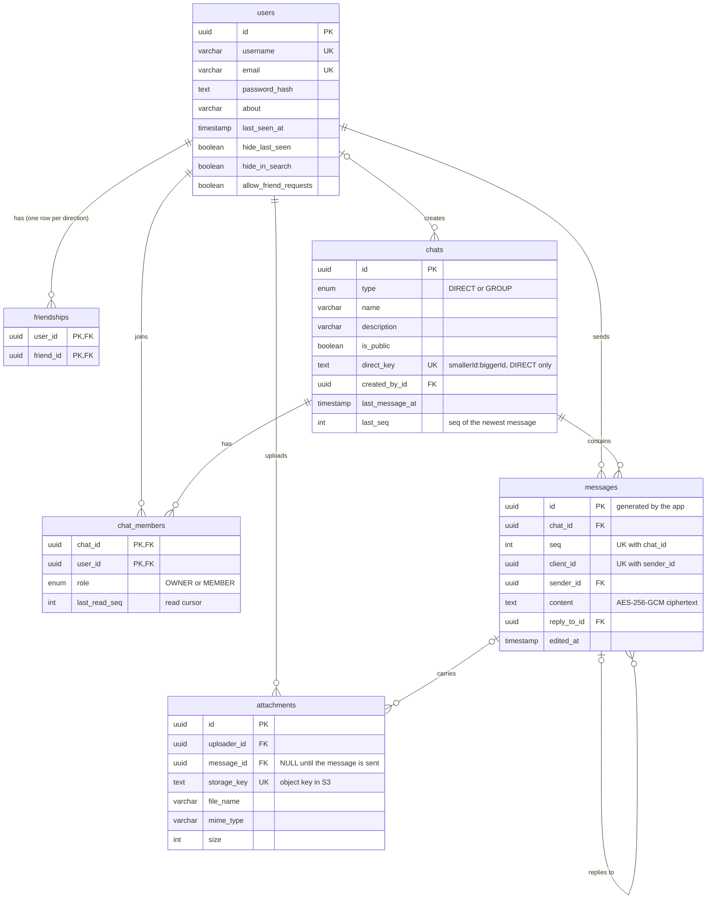

# Database

PostgreSQL, accessed through Prisma 7. The source of truth is [`apps/api/prisma/schema.prisma`](../apps/api/prisma/schema.prisma); the SQL history is in `apps/api/prisma/migrations/`. Table and column names are `snake_case` in the database and `camelCase` in code.

## Entity-relationship diagram



## Why it looks like this

| Decision                                                            | Reason                                                                                                                                                                                      |
| ------------------------------------------------------------------- | ------------------------------------------------------------------------------------------------------------------------------------------------------------------------------------------- |
| Messages are rows in `messages`, not an array inside the chat       | Pagination, no document size limit, no loading the whole history. The old MongoDB version embedded every message in the chat document.                                                      |
| `messages.seq`, a gap-free counter per chat                         | Defines ordering, the pagination cursor and the read cursors, and lets a client detect a missed message. It comes from `chats.last_seq`, incremented in the same transaction as the insert. |
| `chat_members.last_read_seq` instead of a `readBy` list per message | Reading 50 messages is one tiny update, an unread count is `count(seq > cursor)`, and a read receipt is `last_read_seq >= seq`.                                                             |
| `unique (sender_id, client_id)` on messages                         | A retried send (the acknowledgement was lost) cannot create a duplicate. A NULL `client_id` never collides.                                                                                 |
| `chats.direct_key` is unique                                        | At most one direct chat per pair of users, no matter who starts it.                                                                                                                         |
| `friendships` has two rows per friendship                           | "My friends" is a plain `WHERE user_id = me`; adding a friend is instant and mutual.                                                                                                        |
| `messages.content` is ciphertext                                    | Message text is encrypted by the application before it is written (AES-256-GCM, key ring in the environment), so a database dump alone does not reveal it.                                  |
| `attachments` stores metadata only                                  | The file itself lives in S3 (SeaweedFS locally); `storage_key` is its object key.                                                                                                           |
| `messages.id` is generated by the application                       | The id is part of the encryption's authenticated data, so it has to be known before the row is inserted.                                                                                    |

## What happens on delete

| Deleting… | Effect                                                                                                                                                       |
| --------- | ------------------------------------------------------------------------------------------------------------------------------------------------------------ |
| a chat    | its members, messages and (through the messages) attachments are deleted                                                                                     |
| a message | its attachments are deleted; messages that replied to it keep existing with `reply_to_id = NULL`                                                             |
| a user    | their friendships, memberships and uploads are deleted; their **messages stay** with `sender_id = NULL`; chats they created stay with `created_by_id = NULL` |

Deleting a message leaves a **gap in `seq`**. Numbers are never reused, so the order and the read cursors stay valid, and clients that notice a gap simply refetch.

Deleting a message row does not delete the file in S3. The application removes the objects (`StorageService.deleteMany`) in the same operation.

## Known limitation

Usernames are unique **case-sensitively** (`alice` and `Alice` can both exist). A case-insensitive rule would need a functional index that Prisma cannot express in its schema, so every `migrate dev` would try to drop it again.

## Working with the database

```bash
pnpm infra:up                     # start Postgres (and S3)
pnpm db:migrate                   # create and apply a migration after editing schema.prisma
pnpm --filter @chat/api db:studio # browse the data
pnpm --filter @chat/api test:int  # run the schema tests against the throw-away `chat_test` database
```

Demo data for development: `pnpm db:seed` (three users, `alice`, `bob` and `carol`, password `password123`).

Integration tests never touch development data: they use a separate database named `chat_test` on the same server, created and migrated automatically.
