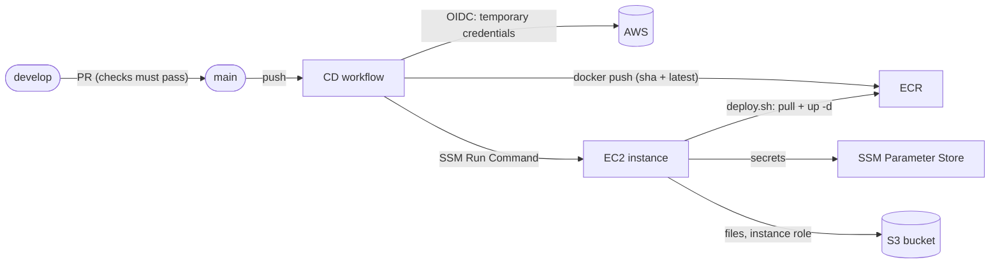

# Deployment

How the app gets from a merged pull request to a running server, and the one-time AWS setup that makes it possible. The reasoning is in the improvement plan, Step 18.

## The big picture



One small VM, no Kubernetes or ECS. On the instance, Docker Compose runs three containers: **Caddy** (serves the web app, terminates HTTPS, proxies `/api` and `/socket.io`), the **api**, and **PostgreSQL** (data in a Docker volume on an encrypted disk). There is no SSH: Session Manager is the way in, and a deployment is an SSM command.

| File                                                                  | Role                                                                   |
| --------------------------------------------------------------------- | ---------------------------------------------------------------------- |
| [`.github/workflows/cd.yml`](../.github/workflows/cd.yml)             | builds and pushes the images, then runs `deploy.sh` on the instance    |
| [`deploy/docker-compose.prod.yml`](../deploy/docker-compose.prod.yml) | the production stack                                                   |
| [`deploy/deploy.sh`](../deploy/deploy.sh)                             | fetches the secrets, pulls the images of one tag, restarts the stack   |
| [`deploy/env.example`](../deploy/env.example)                         | the non-secret settings (becomes `/opt/chat-app/.env` on the instance) |

## Where each secret lives

| Value                                                               | Stored in                                                     | Never in            |
| ------------------------------------------------------------------- | ------------------------------------------------------------- | ------------------- |
| `JWT_SECRET`, `MESSAGE_KEYS`, `POSTGRES_PASSWORD`, `DATABASE_URL`   | SSM Parameter Store (`SecureString`), under `/chat-app/prod/` | git, images, GitHub |
| AWS credentials for the deployment                                  | nowhere: GitHub Actions gets temporary ones through OIDC      | GitHub secrets      |
| AWS credentials for S3                                              | nowhere: the api uses the EC2 instance role                   | `.env` files        |
| `AWS_DEPLOY_ROLE_ARN` (not secret by itself, but not public either) | GitHub repository secret                                      |                     |

`deploy.sh` writes the SSM values to `/opt/chat-app/.env.secrets` (owner-only permissions) on every deployment, and refuses to continue if one of the four is missing.

**Back up `MESSAGE_KEYS` somewhere safe** (a password manager). It holds the keys that encrypt every stored message; if it is lost, the messages are unreadable. Never delete an old key from it while messages encrypted with it exist (see [security](../README.md#security)).

## One-time setup

Do these once, in the AWS console and on the instance. Replace `<region>`, `<account-id>` and `<bucket>`.

### 1. ECR

Create two private repositories: `chat-app-api` and `chat-app-web`.

### 2. S3 bucket

Create `chat-app-attachments-<random>` in your region. Keep **Block all public access** on: signed URLs still work, and files are never public. Default encryption (SSE-S3) is on.

### 3. IAM role for the instance

Create the role `chat-app-ec2` with:

- the managed policies `AmazonSSMManagedInstanceCore` and `AmazonEC2ContainerRegistryReadOnly`;
- an inline policy allowing `s3:GetObject`, `s3:PutObject` and `s3:DeleteObject` on `arn:aws:s3:::<bucket>/*`, and `s3:ListBucket` on `arn:aws:s3:::<bucket>`;
- an inline policy allowing `ssm:GetParametersByPath` on `arn:aws:ssm:<region>:<account-id>:parameter/chat-app/prod/*` (the default `aws/ssm` key needs no extra KMS permission).

In production (`NODE_ENV=production`) the api never creates the bucket: it must exist, and the role needs no `s3:CreateBucket`.

### 4. EC2 instance

- Amazon Linux 2023, `t3.small` (x86, matching the images GitHub builds), 20 GB disk, the role above.
- **Tick "Encrypted"** on the volume: the disk and its snapshots, including the Postgres data, are encrypted at rest.
- Security group: inbound **80 and 443 only**. No SSH.
- Under _Advanced details_ set **Metadata response hop limit to 2**. With the default of 1, containers cannot reach the instance role and every S3 call fails with a credentials error.
- Optional: an Elastic IP, and a DNS `A` record if you have a domain.

### 5. Secrets in Parameter Store

Run these from your own computer, not from the repository:

```bash
aws ssm put-parameter --type SecureString --name /chat-app/prod/JWT_SECRET --value "$(openssl rand -base64 48)"
aws ssm put-parameter --type SecureString --name /chat-app/prod/MESSAGE_KEYS --value "1:$(openssl rand -base64 32)"
aws ssm put-parameter --type SecureString --name /chat-app/prod/POSTGRES_PASSWORD --value "<a strong password without $ # or quotes>"
aws ssm put-parameter --type SecureString --name /chat-app/prod/DATABASE_URL --value "postgresql://chat:<the same password>@postgres:5432/chat"
```

### 6. Prepare the instance

Connect with Session Manager, then install Docker and the Compose plugin (for Compose, use the Amazon Linux commands from the Docker documentation):

```bash
sudo dnf install -y docker && sudo systemctl enable --now docker
```

```bash
sudo mkdir -p /opt/chat-app
```

Copy `deploy/docker-compose.prod.yml` and `deploy/deploy.sh` into `/opt/chat-app`, and create `/opt/chat-app/.env` from `deploy/env.example` (the registry, your domain or `:80`, the bucket and the region).

### 7. GitHub OIDC

In IAM:

1. Add the identity provider `token.actions.githubusercontent.com` with the audience `sts.amazonaws.com`.
2. Create the role `chat-app-github-deploy`. Its trust policy must only accept this repository's `main` branch:

   ```json
   {
     "Effect": "Allow",
     "Principal": {
       "Federated": "arn:aws:iam::<account-id>:oidc-provider/token.actions.githubusercontent.com"
     },
     "Action": "sts:AssumeRoleWithWebIdentity",
     "Condition": {
       "StringEquals": {
         "token.actions.githubusercontent.com:aud": "sts.amazonaws.com",
         "token.actions.githubusercontent.com:sub": "repo:MaxKorop/Chat-App:ref:refs/heads/main"
       }
     }
   }
   ```

3. Its permissions: ECR push to the two repositories (plus `ecr:GetAuthorizationToken`), `ssm:SendCommand` on the instance and on the document `AWS-RunShellScript`, and `ssm:GetCommandInvocation`.

### 8. GitHub settings

- Secret: `AWS_DEPLOY_ROLE_ARN`.
- Variables: `AWS_REGION` and `EC2_INSTANCE_ID`.
- An environment named `production` (optionally with required reviewers, so a deployment waits for a click).
- Rulesets, so the flow in [Contributing](../README.md#contributing) is enforced: `main` requires a pull request and the checks `checks`, `api-integration`, `commits`, `docker` and `from-develop`, and blocks force pushes; `develop` requires a pull request plus `checks`, `api-integration` and `commits`. Use "Create a merge commit" or "Rebase" as the merge method so the conventional commits survive.

## Deploying

Merge a pull request from `develop` into `main`. The CD workflow then:

1. assumes the AWS role through OIDC;
2. builds both images and pushes them tagged with the commit sha and `latest`;
3. sends `sh /opt/chat-app/deploy.sh <sha>` to the instance through SSM and waits for it;
4. prints what the instance printed, also when it failed.

The api container runs `prisma migrate deploy` before it starts, so database migrations are applied by the same deployment. A failed migration makes the new api container exit, and the old one has already been replaced, so the api stays down until you fix it and deploy again, or roll back (below). Check the printed output.

After the first deployment, open the instance's address (or your domain). Create a user, send a message, upload an image, and check that the file is in the bucket.

## Rollback

Every image is tagged with its commit sha. Either run the **CD** workflow by hand (_Run workflow_) on an older commit, or on the instance:

```bash
sudo sh /opt/chat-app/deploy.sh <old-sha>
```

Migrations are not undone by a rollback. Write them so that the previous version of the app still works with the new schema (add columns, do not rename or drop them in the same release).

## Troubleshooting

| Symptom                                         | Likely cause                                                                                     |
| ----------------------------------------------- | ------------------------------------------------------------------------------------------------ |
| S3 calls fail with "Could not load credentials" | the metadata hop limit is still 1 (step 4)                                                       |
| `deploy.sh` says `missing secret ...`           | a parameter is not under `/chat-app/prod/`, or the instance role lacks `ssm:GetParametersByPath` |
| the CD job fails at "Configure AWS credentials" | the trust policy `sub` does not match `repo:MaxKorop/Chat-App:ref:refs/heads/main`               |
| the api container restarts in a loop            | read its log with `docker compose logs api`: invalid environment, or a failed migration          |
| Caddy cannot get a certificate                  | the DNS record does not point at the instance yet, or port 80 or 443 is closed                   |
| messages show as unreadable after a redeploy    | `MESSAGE_KEYS` was changed or lost: restore the backed-up value                                  |
