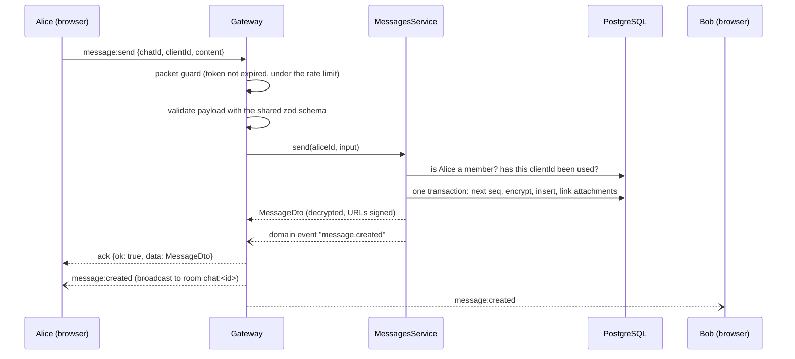

# Real-time (Socket.IO)

Everything about messages that happens "live" goes through **one authenticated Socket.IO connection**: sending, editing and deleting messages, read cursors, typing, presence, and the notifications that other people did something. REST (see [api.md](./api.md)) keeps the rest: sign-up, profiles, chats, message **history** and file **upload**. The reasoning (why WebSocket and not SSE, why uploads stay on REST) is in the improvement plan, §2.8.

The event names and payload types are declared once, in [`packages/shared/src/socket-events.ts`](../packages/shared/src/socket-events.ts). The server (`apps/api/src/modules/realtime`) and the web app both use those types, and a test fails if an event is missing from this page.

## Connecting

```ts
import { io } from 'socket.io-client';

const socket = io({
  transports: ['websocket'], // long-polling is switched off on the server
  auth: (done) => done({ token: accessToken }), // evaluated again on every reconnect
});
```

- Use the **same origin** as the web app. In development the Vite proxy forwards `/socket.io`; in production Caddy does.
- The token is the same JWT as for REST. It goes in the handshake **`auth` payload**. A token in the URL is ignored on purpose (URLs end up in logs), and so is any "user" the client claims to be.
- If the handshake is refused, the client gets a `connect_error` whose message is **`Unauthorized`** (missing, invalid or expired token) or **`Server error`** (the server could not load the user's chats; retry later). On `Unauthorized`, log the user out.
- The server loads the user's chats during the handshake and puts the socket into one room per chat (`chat:<id>`) and one personal room (`user:<id>`). Rooms are never chosen by the client.

## Acknowledgements

Commands the client waits for take a callback and answer with:

```ts
type Ack<T> = { ok: true; data: T } | { ok: false; error: string };
```

`error` is a readable sentence (for example `You are not a member of this chat`, or the first validation problem). Unexpected failures always say just `Internal error`; the details stay in the server log. Use a timeout:

```ts
const ack = await socket.timeout(8_000).emitWithAck('message:send', input);
```

## Events from the client

| Event            | Payload                                                     | Answer            | What it does                                                                        |
| ---------------- | ----------------------------------------------------------- | ----------------- | ----------------------------------------------------------------------------------- |
| `message:send`   | `{ chatId, clientId, content?, replyToId?, attachmentIds }` | `Ack<MessageDto>` | Stores and broadcasts a message. `clientId` is a UUID the client generates.         |
| `message:edit`   | `{ messageId, content }`                                    | `Ack<MessageDto>` | Changes the text of your own message.                                               |
| `message:delete` | `{ messageId }`                                             | `Ack<void>`       | Deletes your message (or any message, if you own the group or it is a direct chat). |
| `chat:read`      | `{ chatId, seq }`                                           | none              | Moves your read cursor forward to `seq`.                                            |
| `typing`         | `{ chatId, isTyping }`                                      | none              | Tells the others in the chat that you started or stopped typing.                    |

## Events from the server

| Event              | Payload                                  | Sent to                                        |
| ------------------ | ---------------------------------------- | ---------------------------------------------- |
| `message:created`  | `MessageDto`                             | everyone in the chat, **including the sender** |
| `message:updated`  | `MessageDto`                             | everyone in the chat                           |
| `message:deleted`  | `{ chatId, messageId }`                  | everyone in the chat                           |
| `chat:read`        | `{ chatId, userId, seq }`                | everyone in the chat, including the reader     |
| `typing`           | `{ chatId, userId, username, isTyping }` | the others in the chat (not the typist)        |
| `chat:changed`     | `{ chatId }`                             | the users who were just added to a chat        |
| `presence:changed` | `{ userId, isOnline }`                   | everyone who shares a chat with that user      |

`chat:changed` means "your chat list is out of date, refetch it". It is sent when a chat is created with you in it, and when you join a public group. From that moment your open sockets also receive that chat's messages, with no reconnect needed.

## What a client can rely on

- **A send is idempotent.** If the acknowledgement is lost, send again with the **same `clientId`**: you get the same message back, and it is stored and broadcast only once. Reusing a `clientId` for a different chat is an error.
- **Order is `seq`.** Every message has a per-chat number. Insert by `seq`, not by arrival time. Deleting a message leaves a gap, so a gap does not mean something was lost. A message whose `seq` is not "newest + 1" is a reason to refetch the history.
- **You receive your own messages twice**, once as the acknowledgement and once as `message:created`. De-duplicate by `id`.
- **After any reconnect, refetch.** Events sent while you were offline are not replayed (Socket.IO's connection-state recovery does not survive a server restart, and every deployment restarts the server). Refetch the chat list and the open chat's history, and treat `connect` events after the first one as the trigger.
- **Typing is best-effort.** It is a volatile event: dropped, not queued, if the client is busy. The receiver should stop showing "typing" a few seconds after the last `isTyping: true`, which also covers a tab that was closed.
- **Read cursors only move forward**, never past the newest message, and marking an old `seq` again is silently ignored.

## Presence

A user is online while at least one of their sockets is open (all tabs count). When the **last** socket closes, the server waits **5 seconds** before announcing `isOnline: false` and recording `lastSeenAt`, so a page refresh never flickers. `presence:changed` goes only to the rooms of the chats the user is in, never to everybody. To learn who is online right now, use the REST `isOnline` field (it is live); use `presence:changed` for updates.

## Limits and protections

| Protection                      | Value                    | What the client sees                                                                                                    |
| ------------------------------- | ------------------------ | ----------------------------------------------------------------------------------------------------------------------- |
| Authentication at the handshake | JWT in `auth`            | `connect_error: Unauthorized`                                                                                           |
| Token expiry while connected    | checked on every event   | the server closes the socket (`disconnect`, reason `io server disconnect`); reconnecting then fails with `Unauthorized` |
| Rate limit per socket           | 30 events per 10 seconds | events over the limit are dropped **without an acknowledgement**, so the ack times out                                  |
| Maximum packet size             | 100 KB                   | the connection is closed (files go through REST)                                                                        |
| Message length                  | 4000 characters          | `{ ok: false, error }`                                                                                                  |
| Transport                       | WebSocket only           | long-polling clients cannot connect                                                                                     |
| Unknown events                  | ignored                  | nothing happens; the connection stays up                                                                                |

The sender, the user name and the rooms always come from the verified token and the database, never from what the client sends: a payload that claims another `senderId` is simply ignored.

## Sending a message, step by step



The gateway contains no business rules. It validates, calls the service, wraps the outcome in an acknowledgement, and listens to the domain events the services publish. The services (`apps/api/src/modules/messages`, `chats`) do not know sockets exist.

## Checking a running server

With the demo data loaded (`pnpm db:seed`) and the api running:

```bash
API_URL=http://localhost:3000 pnpm --filter @chat/api exec tsx scripts/ws-smoke.ts
```

It connects as alice, bob and carol over real WebSockets, checks refusal without a token, delivery to a chat member, no delivery to a non-member, idempotent retries and the membership check, then removes its own test message. The exit code is non-zero if anything fails, so it can also be run after a deployment.
