# Sequence diagram

The main flows of the app in one diagram: log-in, connecting, sending a message, marking messages as read and uploading an image. The same flows, split into smaller diagrams, are in the [README](../README.md#how-it-works).

```mermaid
sequenceDiagram
    autonumber
    actor User
    participant Web as Web (React)
    participant API as API (REST controllers)
    participant IO as Socket.IO gateway
    participant Svc as Services (messages, chats)
    participant DB as PostgreSQL
    participant S3 as S3 (private bucket)

    rect rgb(40, 40, 60)
    Note over User,DB: Log in
    User->>Web: username and password
    Web->>API: POST /api/auth/log-in
    API->>DB: find the user, compare the bcrypt hash
    API-->>Web: access token (JWT) and the user
    Web->>Web: keep the token in local storage
    end

    rect rgb(40, 50, 40)
    Note over Web,DB: Connect
    Web->>IO: WebSocket handshake, token in the auth payload
    IO->>IO: verify the token
    IO->>DB: load the user's chats
    IO->>IO: join the room of every chat and the personal room
    IO-->>Web: connected
    IO--)Web: presence:changed to people who share a chat (5 s grace period after the last tab closes)
    end

    rect rgb(60, 45, 35)
    Note over Web,DB: Send a message
    Web->>Web: show a pending bubble (clock)
    Web->>IO: message:send (chatId, clientId, content, attachmentIds)
    IO->>IO: token not expired, under 30 events per 10 s, payload valid (shared zod schema)
    IO->>Svc: send(senderId from the token, input)
    Svc->>DB: is the sender a member? was this clientId used before?
    Svc->>DB: one transaction: next seq, encrypt text (AES-256-GCM, per-chat key), insert, link attachments
    Svc-->>IO: message (decrypted, URLs signed)
    IO-->>Web: ack ok with the message
    Web->>Web: replace the pending bubble
    IO--)Web: message:created to everyone in the chat room
    Note right of Web: The sender gets the message twice (ack and broadcast): de-duplicate by id. A retry with the same clientId returns the same message.
    end

    rect rgb(40, 55, 55)
    Note over Web,DB: Mark messages as read
    Web->>Web: messages of others on screen, tab visible, 300 ms after the last change
    Web->>IO: chat:read (chatId, seq)
    IO->>Svc: markRead(userId, chatId, seq)
    Svc->>DB: move the read cursor forward (never backwards, never past the newest)
    IO--)Web: chat:read (userId, seq) to everyone in the chat room
    Web->>Web: unread badge clears, the sender's ticks turn to two
    end

    rect rgb(55, 40, 55)
    Note over Web,S3: Upload an image
    Web->>API: POST /api/attachments (multipart)
    API->>API: check size (5 MB) and type (png, jpeg, gif, webp)
    API->>S3: PutObject (random key)
    API->>DB: attachment row (metadata only)
    API-->>Web: attachment ids
    Web->>IO: message:send (content, attachmentIds)
    IO--)Web: message:created with short-lived signed URLs
    Web->>S3: GET the image through its signed URL
    end
```

